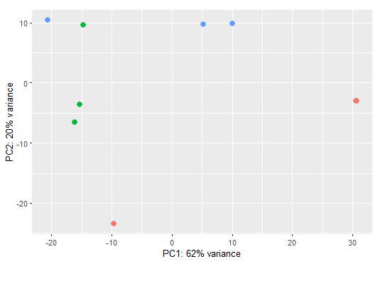
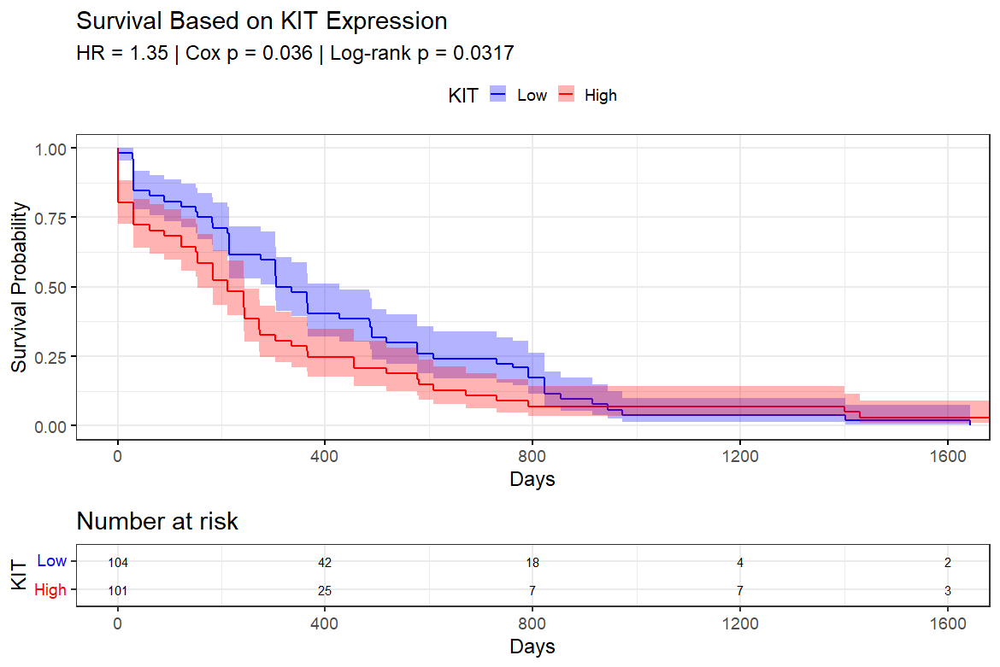

# RNA-seq Differential Expression Pipeline (DESeq2)

## Overview
This project implements a complete RNA-seq differential expression analysis pipeline using DESeq2.

It includes:
- Count file preprocessing and merging
- Differential expression analysis
- Log fold change shrinkage (apeglm)
- PCA visualization
- Volcano plot generation
- Heatmap of top differentially expressed genes

## Tools & Packages
- R
- DESeq2
- tidyverse
- clusterProfiler
- GSVA
- EnhancedVolcano
- ComplexHeatmap
- AnnotationDbi
- org.Hs.eg.db

## How to Run

### 1. Prepare input data
- RNA-seq count files (e.g., featureCounts output)
- Metadata file (coldata.csv) with sample information

### 2. Set file paths
Open the script and update the following paths:

counts_dir <- "path/to/count_files/"
coldata_file <- "path/to/coldata.csv"
output_dir <- "path/to/results/"

### 3. Run the pipeline

In R or terminal:

Rscript 01_deseq2_pipeline.R

### 4. Output
Results will be saved in the output directory, including:
- Differential expression results (Excel)
- PCA plot
- Volcano plot
- GSEA results

## Input Requirements
- Gene count files (e.g., featureCounts output)
- Sample metadata file (coldata.csv)

## Output
- Differential expression results (Excel)
- PCA plot
- Volcano plot
- Heatmap visualization

## Notes
- Data files are not included
- Replace placeholder paths with your own data paths

## Gene Filtering and Ranking

Significant genes are identified based on adjusted p-value (padj < 0.05) thresholds.

Genes are further classified into:
- Upregulated genes (log2FoldChange > 0)
- Downregulated genes (log2FoldChange < 0)

Top genes are extracted and ranked based on fold change or statistical significance.

## Example Output

This pipeline generates the following key outputs:
- PCA plots
- Volcano plots
- Heatmaps of top genes

### Volcano Plot Example

This volcano plot shows significantly differentially expressed genes based on log2 fold change and p-value thresholds.

Note: This figure is for demonstration purposes and does not include identifiable or sensitive data.

### PCA Plot

Principal Component Analysis (PCA) showing clustering of samples based on gene expression profiles.

Note: Sample groups are anonymized for demonstration purposes.

### Pathway Enrichment Analysis (GSEA)

Gene Set Enrichment Analysis (GSEA) highlighting significantly upregulated and downregulated pathways.

Note: Results are presented in a simplified format for demonstration purposes.

### Additional Analysis

This project also includes extended downstream analyses such as:

- Gene set enrichment visualization (dot plots and enrichment plots)
- Identification and ranking of significant genes
- Functional interpretation of differentially expressed genes

Note: Some visualizations are not displayed to avoid sharing sensitive or unpublished data.

## Stemness Analysis (ssGSEA)

Single-sample Gene Set Enrichment Analysis (ssGSEA) showing stemness-related enrichment scores across samples.

This analysis highlights transcriptional programs associated with stem-like phenotypes.

Note: Sample groups are anonymized for demonstration purposes.

## Drug Resistance Signature (Venetoclax)

A Venetoclax-related gene signature was identified by intersecting significantly upregulated genes with known apoptosis and BCL2-family genes.

This highlights potential molecular mechanisms driving drug resistance in AML models.

Note: Full gene lists are not displayed due to data sensitivity.

## Translational Relevance

This pipeline goes beyond standard differential expression by integrating:

- Functional pathway analysis (GSEA / ssGSEA)
- Drug-response signature identification (Venetoclax resistance)
- Clinical validation using survival analysis (TCGA)

This is a translational workflow connecting molecular data to clinical outcomes.

## Clinical Validation (Survival Analysis)

To assess clinical relevance, survival analysis was performed using publicly available datasets:

- TCGA (The Cancer Genome Atlas)
- TARGET AML dataset
- BeatAML cohort

Kaplan-Meier survival curves and Cox proportional hazards models were applied to evaluate prognostic significance of selected genes.

Example survival plots are shown below.

Note: Only representative results are displayed.

## Author
Hager Salah Abouelnaga
