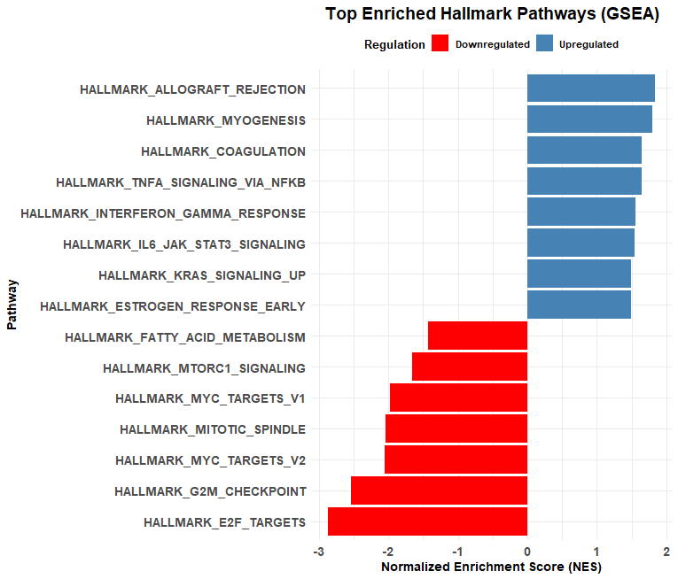

# RNA-seq Differential Expression Pipeline (DESeq2)

## Overview
This project implements a complete RNA-seq differential expression analysis pipeline using DESeq2.

It includes:
- Count file preprocessing and merging
- Differential expression analysis
- Log fold change shrinkage (apeglm)
- PCA visualization
- Volcano plot generation
- Heatmap of top differentially expressed genes

## Tools & Packages
- DESeq2
- tidyverse
- EnhancedVolcano
- ComplexHeatmap
- AnnotationDbi
- org.Hs.eg.db

## Input Requirements
- Gene count files (e.g., featureCounts output)
- Sample metadata file (coldata.csv)

## Output
- Differential expression results (Excel)
- PCA plot
- Volcano plot
- Heatmap visualization

## Notes
- Data files are not included
- Replace placeholder paths with your own data paths

## Example Output

This pipeline generates the following key outputs:
- PCA plots
- Volcano plots
- Heatmaps of top genes

### Volcano Plot Example

This volcano plot shows significantly differentially expressed genes based on log2 fold change and p-value thresholds.

Note: This figure is for demonstration purposes and does not include identifiable or sensitive data.

### Pathway Enrichment Analysis (GSEA)

Gene Set Enrichment Analysis (GSEA) highlighting significantly upregulated and downregulated pathways.

Note: Results are presented in a simplified format for demonstration purposes.

### Pathway Enrichment Analysis (GSEA)

Gene Set Enrichment Analysis (GSEA) highlighting significantly upregulated and downregulated pathways.

Note: Results are presented in a simplified format for demonstration purposes.

## Author
Hager Salah Abouelnaga
